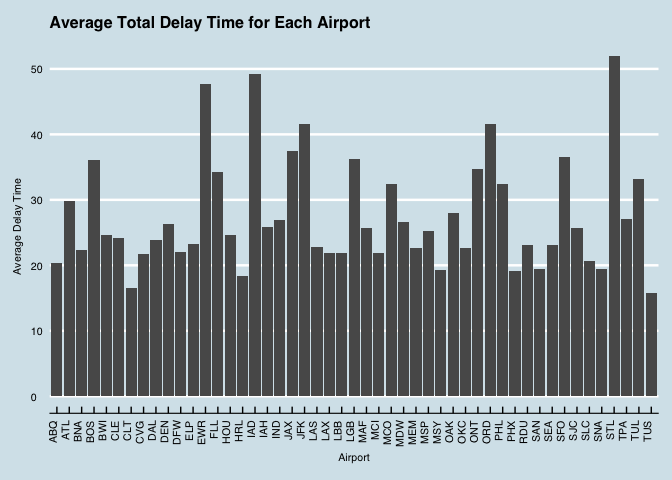

Which airport is the worst airport to fly in?
---------------------------------------------

  Our answer is STL!

  We reach our conclusion by looking at the average cancellation
rate for all the destination airports, and the average delay time both
total and for different reasons for all the destination. In addition, we
only look at airports with more than 10 flights from Austin in total in
our dataset to try to tackle some outliers.

    flight = read.csv("~/Downloads/ABIA.csv")
    # get the total flight to one 
    flight["count"] = 1
    # only look at flights leaving Austin
    aus = flight[flight$Origin == "AUS", c(1:30)]
    total_flight = aggregate(count ~ Dest, aus, sum)
    # merge the total number of flights for each dest
    aus = merge(aus,total_flight,by="Dest", all.x = TRUE)

    # look into the cancelled flight
    cancelled = aus[aus$Cancelled == 1, c(1:31)]
    total_cancelled_flight = aggregate(count.x ~ Dest, cancelled, sum)

    # create a column containing average percent of cancelled flight for each destination
    merged = merge(total_flight, total_cancelled_flight, by="Dest", all.x = TRUE)
    merged[is.na(merged)] <- 0
    merged["average"] = (merged["count.x"] / merged["count"])*100

    #delete airports with less than 10 flights
    merged_delete = merged[merged['count'] > 10, c(1:4)]

    # get the logitude and latitude of airports
    usairports <- filter(airports, lat < 48.5)
    usairports <- filter(usairports, lon > -130)

    # merge the location to the final dataset
    cancelled_location = merge(merged_delete, usairports, by.x="Dest", by.y = "faa", all.x = TRUE)

    # plot the rate of cancellation
    colourCount = length(unique(cancelled_location$Dest))
    getPalette = colorRampPalette(brewer.pal(12, "Set3"))

    states = map_data('state')
    ggplot(data = states) + 
      geom_polygon(aes(x = long, y = lat, fill = region, group = group), color = "white") + 
      coord_fixed(1.3) + scale_fill_manual(values = getPalette(colourCount)) +
      guides(fill=FALSE) + geom_point(aes(x = cancelled_location$lon, y = cancelled_location$lat, size=cancelled_location$average), data = cancelled_location, color='blue4') + geom_text(aes(x = cancelled_location$lon, y = cancelled_location$lat-0.7, label = cancelled_location$Dest, size=0.7), data = cancelled_location) + theme_fivethirtyeight() + ggtitle('Average Cancellation Rate for Each Airport')

  
Top 5 airports with the average cancellation rate: STL, ORD, SJC, DFW,
MEM

    # get the delay
    # only look at the delayed flight
    delayed = aus[aus$ArrDelay > 0, c(1:31)]
    #delete airports with less than 10 flights
    delayed = delayed[delayed['count.y'] > 10, c(1:31)]
    total_delayed = cbind(aggregate(ArrDelay ~ Dest, delayed, mean), aggregate(CarrierDelay ~ Dest, delayed, mean), aggregate(WeatherDelay ~ Dest, delayed, mean), aggregate(NASDelay ~ Dest, delayed, mean), aggregate(SecurityDelay ~ Dest, delayed, mean), aggregate(LateAircraftDelay ~ Dest, delayed, mean))

    delay_total = aggregate(ArrDelay ~ Dest, delayed, mean)
    delay_total  = delay_total[order(delay_total$ArrDelay), ]
    ggplot() + geom_bar(aes(y = ArrDelay, x = Dest), data = delay_total, stat="identity") + labs(x= 'Airport', y="Average Delay Time") + theme_economist() + scale_fill_economist() + ggtitle("Average Total Delay Time for Each Airport") + theme(text = element_text(size=8),
            axis.text.x = element_text(angle=90, hjust=1)) 

  
top 5 airport with the highest average delay time: STL, IAD, EWR, JFK,
ORD   Both STL and ORD appear in the top 5 cancellation and delay
airports, and STL ranks the first for both as well.

    # get the top 5 airports for each delay type
    total_delayed_1 = total_delayed[order(-total_delayed$CarrierDelay), ]         
    total_delayed_1 = total_delayed_1[1:5,3:4]
    names(total_delayed_1)[names(total_delayed_1) == 'CarrierDelay'] <- 'DelayTime'

    total_delayed_2 = total_delayed[order(-total_delayed$WeatherDelay), ]         
    total_delayed_2 = total_delayed_2[1:5,5:6]
    names(total_delayed_2)[names(total_delayed_2) == 'WeatherDelay'] <- 'DelayTime'

    total_delayed_3 = total_delayed[order(-total_delayed$NASDelay), ]         
    total_delayed_3 = total_delayed_3[1:5,7:8]
    names(total_delayed_3)[names(total_delayed_3) == 'NASDelay'] <- 'DelayTime'

    total_delayed_4 = total_delayed[order(-total_delayed$SecurityDelay), ]         
    total_delayed_4 = total_delayed_4[1:5,9:10]
    names(total_delayed_4)[names(total_delayed_4) == 'SecurityDelay'] <- 'DelayTime'

    total_delayed_5 = total_delayed[order(-total_delayed$LateAircraftDelay), ]         
    total_delayed_5 = total_delayed_5[1:5,11:12]
    names(total_delayed_5)[names(total_delayed_5) == 'LateAircraftDelay'] <- 'DelayTime'

    top_delayed = rbind(total_delayed_1, total_delayed_2, total_delayed_3, total_delayed_4, total_delayed_5)

    top_delayed_type = data.frame(Dest = top_delayed$Dest, time = top_delayed$DelayTime, DelayType = c(rep("CarrierDelay", 5), rep("WeatherDelay",5), rep("NASDelay",5),rep("SecurityDelay",5), rep("AircraftDelay", 5)))
    ggplot(top_delayed_type, aes(fill=Dest, y=time, x=DelayType)) + geom_bar(position="dodge", stat="identity") + scale_fill_manual(values = getPalette(colourCount)) + ggtitle('Top 5 Airports with the Largest Delay Time for Different Reasons') + theme_bw() 

  
AircraftDelay has the largest delay time among all types of reasons. STL
also ranks the first among this group. This is another support for us to
choose STL as the worst airport to fly in.

  Therefore, based on the average cancellation rate and the average
total delay time for different airports, we finally decide STL is the
worst airport to fly in. But one concern is that STL has 95 flights from
Austin in our dataset, which is actually not a big destination. If
considering the total number of flights, then ORD is also a bad
destination.
