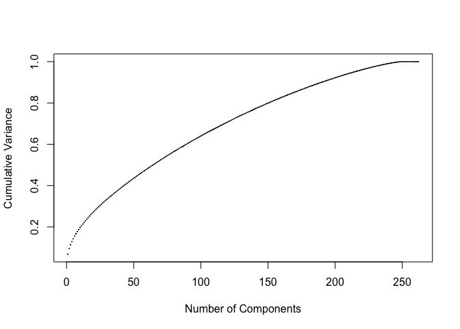

To set up the analysis, the first step is to read in all associated text
files.

Before further processing the data, we did pre-processing such as
removing numbers and punctuations from the original data set.

    # Preprocessing: removing
    my_corpus = tm_map(my_corpus, content_transformer(tolower)) # make everything lowercase
    my_corpus = tm_map(my_corpus, content_transformer(removeNumbers)) # remove numbers
    my_corpus = tm_map(my_corpus, content_transformer(removePunctuation)) # remove punctuation
    my_corpus = tm_map(my_corpus, content_transformer(stripWhitespace)) ## remove excess white-space
    my_corpus = tm_map(my_corpus, content_transformer(removeWords), union(stopwords("SMART"), stopwords('en')))
    DTM = DocumentTermMatrix(my_corpus)

Model 1 - Naive Bayes
---------------------

The first model selected is Naive Bayes. Before we put data into model,
we considered four processing actions to increase accuracy and they
are:  1. Remove terms that count 0 below certain percentage of
docs  2. Remove terms below certain count  3. TF-IDF   4.
PCA  

For action 1, we assigned different percentage to test which generates
the highest accuracy in naive bayes. According to the plot, 0.895 is our
best choice as the percentage, which gives the accuracy of 37.5%.

    acc = NULL
    per_list = seq(0.855, 0.90, 0.01)
    for (i in per_list){
      DTM_test = removeSparseTerms(DTM, i)
      X = as.matrix(DTM_test)
      acc = append(acc, test(X))
    }
    plot(per_list, acc, type='b')

    DTM = removeSparseTerms(DTM, 0.895)

The next step is to set the threshold for the minimum count for the bag
of words. Mutiple thresholds have been tested, but no significant
improvement on the accuracy rate. Therefore, the action 2 will not be
taken.

After applying TF-IDF processing, the third tool, to the dataset, its
accuracy increases to 43.56%

    X = as.matrix(DTM)
    TF <- X / rowSums(X)
    EXI_NUM<-apply(X>0, 2, function(x){table(x)['TRUE']})
    IDF<-as.numeric(1 + log(nrow(X)/EXI_NUM))
    TFIDF = data.frame(t(t(TF)*IDF))
    test(as.matrix(TFIDF))

    ## [1] 0.3624

    X = TFIDF

The last tool we consider is PCA. PCA requires to select the optimal
number of principal components. Therefore, we draw the following plot to
illustrate the cumulative variance represented for different number of
components. However, we cannot find the "elbow" point on the curve, so
we tested multiple options mannually.

    pca = prcomp(X, scale=TRUE)
    plot(cumsum((pca$sdev)^2)/sum(pca$sdev^2), pch=19, cex=0.1, ylab='Cumulative Variance', xlab='Number of Components' )

According to below curve, when we select the 105 most important
components in PCA, we have further increased our accuracy to 50.12%

    pca_list = seq(101, 110, 1)
    acc = NULL
    for (i in pca_list){
      X_test = pca$x[, 1:i]
      acc = append(acc, test(X_test))
    }
    X = pca$x[, 1:105]
