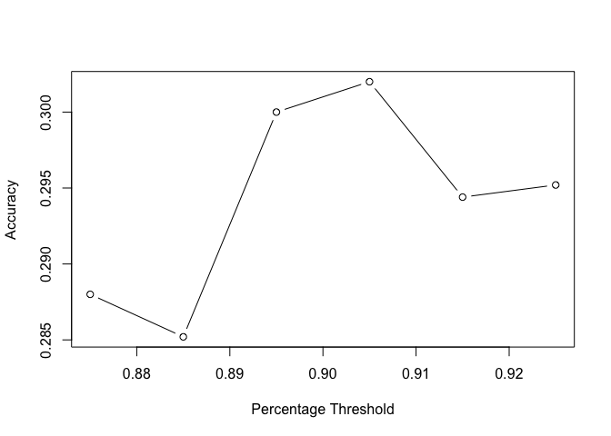

Flights at ABIA
===============

Which airport is the worst airport to fly in?

Our answer is STL!

We reach our conclusion by looking at the average cancellation
rate for all the destination airports, and the average delay time both
total and for different reasons for all the destination. In addition, we
only look at airports with more than 10 flights from Austin in total in
our dataset to try to tackle some outliers.

    flight = read.csv("~/Downloads/ABIA.csv")
    # get the total flight to one 
    flight["count"] = 1
    # only look at flights leaving Austin
    aus = flight[flight$Origin == "AUS", c(1:30)]
    total_flight = aggregate(count ~ Dest, aus, sum)
    # merge the total number of flights for each dest
    aus = merge(aus,total_flight,by="Dest", all.x = TRUE)

    # look into the cancelled flight
    cancelled = aus[aus$Cancelled == 1, c(1:31)]
    total_cancelled_flight = aggregate(count.x ~ Dest, cancelled, sum)

    # create a column containing average percent of cancelled flight for each destination
    merged = merge(total_flight, total_cancelled_flight, by="Dest", all.x = TRUE)
    merged[is.na(merged)] <- 0
    merged["average"] = (merged["count.x"] / merged["count"])*100

    #delete airports with less than 10 flights
    merged_delete = merged[merged['count'] > 10, c(1:4)]

    # get the logitude and latitude of airports
    usairports <- filter(airports, lat < 48.5)
    usairports <- filter(usairports, lon > -130)

    # merge the location to the final dataset
    cancelled_location = merge(merged_delete, usairports, by.x="Dest", by.y = "faa", all.x = TRUE)

    # plot the rate of cancellation
    colourCount = length(unique(cancelled_location$Dest))
    getPalette = colorRampPalette(brewer.pal(12, "Set3"))

    states = map_data('state')
    ggplot(data = states) + 
      geom_polygon(aes(x = long, y = lat, fill = region, group = group), color = "white") + 
      coord_fixed(1.3) + scale_fill_manual(values = getPalette(colourCount)) +
      guides(fill=FALSE) + geom_point(aes(x = cancelled_location$lon, y = cancelled_location$lat, size=cancelled_location$average), data = cancelled_location, color='blue4') + geom_text(aes(x = cancelled_location$lon, y = cancelled_location$lat-0.7, label = cancelled_location$Dest, size=0.7), data = cancelled_location) + theme_fivethirtyeight() + ggtitle('Average Cancellation Rate for Each Airport')

  
Top 5 airports with the average cancellation rate: STL, ORD, SJC, DFW,
MEM

    # get the delay
    # only look at the delayed flight
    delayed = aus[aus$ArrDelay > 0, c(1:31)]
    #delete airports with less than 10 flights
    delayed = delayed[delayed['count.y'] > 10, c(1:31)]
    total_delayed = cbind(aggregate(ArrDelay ~ Dest, delayed, mean), aggregate(CarrierDelay ~ Dest, delayed, mean), aggregate(WeatherDelay ~ Dest, delayed, mean), aggregate(NASDelay ~ Dest, delayed, mean), aggregate(SecurityDelay ~ Dest, delayed, mean), aggregate(LateAircraftDelay ~ Dest, delayed, mean))

    delay_total = aggregate(ArrDelay ~ Dest, delayed, mean)
    delay_total  = delay_total[order(delay_total$ArrDelay), ]
    ggplot() + geom_bar(aes(y = ArrDelay, x = Dest), data = delay_total, stat="identity") + labs(x= 'Airport', y="Average Delay Time") + theme_economist() + scale_fill_economist() + ggtitle("Average Total Delay Time for Each Airport") + theme(text = element_text(size=8),
            axis.text.x = element_text(angle=90, hjust=1)) 

  
top 5 airport with the highest average delay time: STL, IAD, EWR, JFK,
ORD   Both STL and ORD appear in the top 5 cancellation and delay
airports, and STL ranks the first for both as well.

    # get the top 5 airports for each delay type
    total_delayed_1 = total_delayed[order(-total_delayed$CarrierDelay), ]         
    total_delayed_1 = total_delayed_1[1:5,3:4]
    names(total_delayed_1)[names(total_delayed_1) == 'CarrierDelay'] <- 'DelayTime'

    total_delayed_2 = total_delayed[order(-total_delayed$WeatherDelay), ]         
    total_delayed_2 = total_delayed_2[1:5,5:6]
    names(total_delayed_2)[names(total_delayed_2) == 'WeatherDelay'] <- 'DelayTime'

    total_delayed_3 = total_delayed[order(-total_delayed$NASDelay), ]         
    total_delayed_3 = total_delayed_3[1:5,7:8]
    names(total_delayed_3)[names(total_delayed_3) == 'NASDelay'] <- 'DelayTime'

    total_delayed_4 = total_delayed[order(-total_delayed$SecurityDelay), ]         
    total_delayed_4 = total_delayed_4[1:5,9:10]
    names(total_delayed_4)[names(total_delayed_4) == 'SecurityDelay'] <- 'DelayTime'

    total_delayed_5 = total_delayed[order(-total_delayed$LateAircraftDelay), ]         
    total_delayed_5 = total_delayed_5[1:5,11:12]
    names(total_delayed_5)[names(total_delayed_5) == 'LateAircraftDelay'] <- 'DelayTime'

    top_delayed = rbind(total_delayed_1, total_delayed_2, total_delayed_3, total_delayed_4, total_delayed_5)

    top_delayed_type = data.frame(Dest = top_delayed$Dest, time = top_delayed$DelayTime, DelayType = c(rep("CarrierDelay", 5), rep("WeatherDelay",5), rep("NASDelay",5),rep("SecurityDelay",5), rep("AircraftDelay", 5)))
    ggplot(top_delayed_type, aes(fill=Dest, y=time, x=DelayType)) + geom_bar(position="dodge", stat="identity") + scale_fill_manual(values = getPalette(colourCount)) + ggtitle('Top 5 Airports with the Largest Delay Time for Different Reasons') + theme_bw() 

  
AircraftDelay has the largest delay time among all types of reasons. STL
also ranks the first among this group. This is another support for us to
choose STL as the worst airport to fly in.

Therefore, based on the average cancellation rate and the average
total delay time for different airports, we finally decide STL is the
worst airport to fly in. But one concern is that STL has 95 flights from
Austin in our dataset, which is actually not a big destination. If
considering the total number of flights, then ORD is also a bad
destination.

Author Attribution
====================

To set up the analysis, the first step is to read in all associated text
files and create related functions.

    # Read in all texts
    library(tm)

    ## Loading required package: NLP

    library(naivebayes)
    train_author_dirs = Sys.glob('~/Downloads/ReutersC50/C50train/*')
    file_list = NULL
    labels = NULL
    for(author in train_author_dirs) {
      author_name = substring(author, first=29)
      files_to_add = Sys.glob(paste0(author, '/*.txt'))
      file_list = append(file_list, files_to_add)
      labels = append(labels, rep(author_name, length(files_to_add)))
    }

    test_author_dirs = Sys.glob('~/Downloads/ReutersC50/C50test/*')
    for(author in test_author_dirs) {
      author_name = substring(author, first=29)
      files_to_add = Sys.glob(paste0(author, '/*.txt'))
      file_list = append(file_list, files_to_add)
      labels = append(labels, rep(author_name, length(files_to_add)))
    }

    readerPlain = function(fname){
      readPlain(elem=list(content=readLines(fname)), 
                id=fname, language='en')}

    all_docs = lapply(file_list, readerPlain)
    names(all_docs) = file_list

    my_corpus = Corpus(VectorSource(all_docs))

    # Create labels for traing and test set
    clean_labels = NULL
    for (i in 1:5000){
      clean_labels = append(clean_labels, strsplit(labels[i], '/')[[1]][3])
    }
    train_y = clean_labels[1:2500]
    test_y = clean_labels[2501:5000]

    # function for train and test, given the training matrix
    test = function(X){
      train_X = X[1:2500,]
      test_X = X[2501:5000,]
      model <- naive_bayes(x = train_X, y = train_y)
      preds <- predict(model, newdata = test_X)
      conf_matrix <- table(preds, test_y)
      sum = 0
      for (i in 1:50){
        sum = sum +  conf_matrix[i, i]
      }
      return(sum/2500)
    }

Before further processing the data, we did pre-processing such as
removing numbers and punctuations from the original data set.

    # Preprocessing: removing
    my_corpus = tm_map(my_corpus, content_transformer(tolower)) # make everything lowercase
    my_corpus = tm_map(my_corpus, content_transformer(removeNumbers)) # remove numbers
    my_corpus = tm_map(my_corpus, content_transformer(removePunctuation)) # remove punctuation
    my_corpus = tm_map(my_corpus, content_transformer(stripWhitespace)) ## remove excess white-space
    my_corpus = tm_map(my_corpus, content_transformer(removeWords), union(stopwords("SMART"), stopwords('en')))
    DTM = DocumentTermMatrix(my_corpus)

Model 1 - Naive Bayes
---------------------

The first model selected is Naive Bayes. Before we put data into model,
we considered four processing actions to increase accuracy and they
are:  1. Remove terms that count 0 below certain percentage of
docs  2. Remove terms below certain count  3. TF-IDF   4.
PCA  

For action 1, we assigned different percentage to test which generates
the highest accuracy in naive bayes. According to the plot, 0.895 is our
best choice as the percentage, which gives the accuracy of 30.2%.

    acc = NULL
    per_list = seq(0.875, 0.925, 0.01)
    for (i in per_list){
      DTM_test = removeSparseTerms(DTM, i)
      X = as.matrix(DTM_test)
      acc = append(acc, test(X))
    }
    plot(per_list, acc, type='b', ylab='Accuracy', xlab='Percentage Threshold')

    DTM = removeSparseTerms(DTM, 0.895)
    max(acc)

    ## [1] 0.302

The next step is to set the threshold for the minimum count for the bag
of words. Mutiple thresholds have been tested, but no significant
improvement on the accuracy rate. Therefore, the action 2 will not be
taken.

After applying TF-IDF processing, the third tool, to the dataset, its
accuracy increases to 36.2%. Therefore, we decide to adopt TF-IDF.

    X = as.matrix(DTM)
    TF <- X / rowSums(X)
    EXI_NUM<-apply(X>0, 2, function(x){table(x)['TRUE']})
    IDF<-as.numeric(log(nrow(X)/EXI_NUM + 1))
    TFIDF = data.frame(t(t(TF)*IDF))
    X <- TFIDF

The last tool we consider is PCA. PCA requires to select the optimal
number of principal components. Therefore, we draw the following plot to
illustrate the cumulative variance represented for different number of
components. However, we cannot find the "elbow" point on the curve, so
we tested multiple options mannually.

    pca = prcomp(X, scale=TRUE)
    plot(cumsum((pca$sdev)^2)/sum(pca$sdev^2), pch=19, cex=0.1, ylab='Cumulative Variance', xlab='Number of Components' )

According to below curve, when we select the 124 most important
components in PCA, we have further increased our accuracy to 43.76%.

    pca_list = seq(115, 125, 1)
    acc = NULL
    for (i in pca_list){
      X_test = pca$x[, 1:i]
      acc = append(acc, test(X_test))
    }
    plot(pca_list, acc, type='b', ylab='Accuracy', xlab='Number of Components')

    max(acc)

    ## [1] 0.4376

Model 2 - RandomForest
---------------------

The second model selected was RandomForest. In terms of both saving
computational cost and remaining a relatively high accuracy, we choose
the parameter ntree=100

    library(randomForest)

    ## randomForest 4.6-12

    ## Type rfNews() to see new features/changes/bug fixes.

    testRF<-function(X){
      X_train = X[1:2500,]
      X_test = X[2501:5000,]
      rfmodel <- randomForest(x=X_train,y=factor(train_y),ntree=100)
      predtest = predict(rfmodel,newdata=X_test)
      conf_matrix = table(predtest,test_y)
      sum = 0
      for(i in 1:dim(conf_matrix)[1]){
        sum = sum + conf_matrix[i,i]
      }
      return (sum/2500)
    }

Similary, we iterated through sparcities, and the highest accuracy
occured when we only removed 0.5% sparcity.

    DTM = DocumentTermMatrix(my_corpus)
    DTM = removeSparseTerms(DTM,0.995)
    X = as.matrix(DTM)
    print(paste('Accuracy for RandomForest is',testRF(X),sep=' '))

[1] "Accuracy for RandomForest is 0.6324"

After applying TF-IDF processing, its accuracy didn't change much.

    #TFIDF
    X = as.matrix(DTM)
    TF = X/rowSums(X)
    EXI_NUM<-apply(X>0, 2, function(x){table(x)['TRUE']})
    IDF<-as.numeric(log(1 + nrow(X)/EXI_NUM))
    TFIDF = data.frame(t(t(TF)*IDF))
    print(paste('Accuracy for RandomForest after TFIDF is',testRF(X),sep=' '))

[1] "Accuracy for RandomForest after TFIDF is 0.6336"

We also considered PCA before using RandomForest, however, accuracy reduced to about 52%.

Comparing accuracies of different models, we prefer randomForest with 0.5% sparcity removed.

To figure out whose articles are hard to distinguish, we calculated the classification accuracy of each author using randomForest model. Darren Schuettler, ScottHillis, WilliamKazer, DavidLawder, EdnaFernandes have lowest classification accuracy comparing to others. Therefore, their articles are hard to distinguish.

    library(pander)

    rfmodel <- randomForest(x=X_train,y=factor(train_y),ntree=100)
    predtest = predict(rfmodel,newdata=X_test)
    conf_matrix = table(predtest,test_y)

    author_acc = foreach (i = 1:50, .combine = 'c') %do% {
      conf_matrix[i,i]/sum(conf_matrix[,i])
    }

    names(author_acc) = rownames(conf_matrix)
    pander(sort(author_acc)[1:5])

<table>
<colgroup>
<col width="18%" />
<col width="21%" />
<col width="18%" />
<col width="18%" />
<col width="21%" />
</colgroup>
<thead>
<tr class="header">
<th align="center">DavidLawder</th>
<th align="center">JaneMacartney</th>
<th align="center">ScottHillis</th>
<th align="center">EricAuchard</th>
<th align="center">AlexanderSmith</th>
</tr>
</thead>
<tbody>
<tr class="odd">
<td align="center">0.14</td>
<td align="center">0.2</td>
<td align="center">0.2</td>
<td align="center">0.22</td>
<td align="center">0.24</td>
</tr>
</tbody>
</table>

Association Rule Mining
--------------------

    library(arules)
    library(pander)

**Processing Data**

Initialize the dataframe to be processed by the apriori algorithm

    itemlists <- data.frame(0,0)
    names(itemlists) <- c("num","item")

Read each line and tag transaction numbers to each item

    #Keep track of the number of line(transaction)

    trans = 0
    for(line in readLines("groceries.txt")){
        trans = trans + 1
        basket <- unlist(strsplit(line,","))
        for(i in 1:length(basket)){
            if((trans == 1) & (i == 1)){
                itemlists[1,] <- c(trans, basket[i])
            }
            else{itemlists <- rbind(itemlists, c(trans, basket[i]))}
        }
    }

Turn number of transaction into a factor

    itemlists$num <- factor(itemlists$num)
    pander(head(itemlists))

<table style="width:38%;">
<colgroup>
<col width="8%" />
<col width="29%" />
</colgroup>
<thead>
<tr class="header">
<th align="center">num</th>
<th align="center">item</th>
</tr>
</thead>
<tbody>
<tr class="odd">
<td align="center">1</td>
<td align="center">citrus fruit</td>
</tr>
<tr class="even">
<td align="center">1</td>
<td align="center">semi-finished bread</td>
</tr>
<tr class="odd">
<td align="center">1</td>
<td align="center">margarine</td>
</tr>
<tr class="even">
<td align="center">1</td>
<td align="center">ready soups</td>
</tr>
<tr class="odd">
<td align="center">2</td>
<td align="center">tropical fruit</td>
</tr>
<tr class="even">
<td align="center">2</td>
<td align="center">yogurt</td>
</tr>
</tbody>
</table>

The table above shows the head of transaction dataframe before splitting
it by transactions.

apriori algorithm expects a list of baskets in a special format In this
case, one "transaction" of items per user First split data into a list
of items for each transaction

    transactions <- split(x=itemlists$item, f=itemlists$num)
    length(transactions)

    ## [1] 9835

There are 9835 transactions.

    ## Remove duplicates 
    transactions <- lapply(transactions, unique)

    ## Cast this variable as a special arules "transactions" class.
    transactions <- as(transactions, "transactions")

**Applying Apriori Algorithm**

Now run the 'apriori' algorithm

    basketrules <- apriori(transactions, parameter=list(support=.001, confidence=.5, maxlen=10))

    ## Apriori
    ## 
    ## Parameter specification:
    ##  confidence minval smax arem  aval originalSupport maxtime support minlen
    ##         0.5    0.1    1 none FALSE            TRUE       5   0.001      1
    ##  maxlen target   ext
    ##      10  rules FALSE
    ## 
    ## Algorithmic control:
    ##  filter tree heap memopt load sort verbose
    ##     0.1 TRUE TRUE  FALSE TRUE    2    TRUE
    ## 
    ## Absolute minimum support count: 9 
    ## 
    ## set item appearances ...[0 item(s)] done [0.00s].
    ## set transactions ...[169 item(s), 9835 transaction(s)] done [0.00s].
    ## sorting and recoding items ... [157 item(s)] done [0.00s].
    ## creating transaction tree ... done [0.00s].
    ## checking subsets of size 1 2 3 4 5 6 done [0.01s].
    ## writing ... [5668 rule(s)] done [0.00s].
    ## creating S4 object  ... done [0.00s].

    inspect(head(sort(basketrules, by="lift"),20))

    ##      lhs                        rhs                      support confidence      lift
    ## [1]  {Instant food products,                                                         
    ##       soda}                  => {hamburger meat}     0.001220132  0.6315789 18.995654
    ## [2]  {popcorn,                                                                       
    ##       soda}                  => {salty snack}        0.001220132  0.6315789 16.697793
    ## [3]  {baking powder,                                                                 
    ##       flour}                 => {sugar}              0.001016777  0.5555556 16.408075
    ## [4]  {ham,                                                                           
    ##       processed cheese}      => {white bread}        0.001931876  0.6333333 15.045491
    ## [5]  {Instant food products,                                                         
    ##       whole milk}            => {hamburger meat}     0.001525165  0.5000000 15.038226
    ## [6]  {curd,                                                                          
    ##       other vegetables,                                                              
    ##       whipped/sour cream,                                                            
    ##       yogurt}                => {cream cheese }      0.001016777  0.5882353 14.834087
    ## [7]  {domestic eggs,                                                                 
    ##       processed cheese}      => {white bread}        0.001118454  0.5238095 12.443639
    ## [8]  {other vegetables,                                                              
    ##       tropical fruit,                                                                
    ##       white bread,                                                                   
    ##       yogurt}                => {butter}             0.001016777  0.6666667 12.030581
    ## [9]  {hamburger meat,                                                                
    ##       whipped/sour cream,                                                            
    ##       yogurt}                => {butter}             0.001016777  0.6250000 11.278670
    ## [10] {domestic eggs,                                                                 
    ##       other vegetables,                                                              
    ##       tropical fruit,                                                                
    ##       whole milk,                                                                    
    ##       yogurt}                => {butter}             0.001016777  0.6250000 11.278670
    ## [11] {liquor,                                                                        
    ##       red/blush wine}        => {bottled beer}       0.001931876  0.9047619 11.235269
    ## [12] {cream cheese ,                                                                 
    ##       other vegetables,                                                              
    ##       whipped/sour cream,                                                            
    ##       yogurt}                => {curd}               0.001016777  0.5882353 11.040638
    ## [13] {hard cheese,                                                                   
    ##       whipped/sour cream,                                                            
    ##       yogurt}                => {butter}             0.001016777  0.5882353 10.615219
    ## [14] {other vegetables,                                                              
    ##       rolls/buns,                                                                    
    ##       root vegetables,                                                               
    ##       tropical fruit,                                                                
    ##       whole milk}            => {beef}               0.001118454  0.5500000 10.483043
    ## [15] {sliced cheese,                                                                 
    ##       tropical fruit,                                                                
    ##       whole milk,                                                                    
    ##       yogurt}                => {butter}             0.001016777  0.5555556 10.025484
    ## [16] {butter,                                                                        
    ##       other vegetables,                                                              
    ##       sugar}                 => {whipped/sour cream} 0.001016777  0.7142857  9.964539
    ## [17] {hard cheese,                                                                   
    ##       whipped/sour cream,                                                            
    ##       whole milk}            => {butter}             0.001423488  0.5384615  9.717008
    ## [18] {domestic eggs,                                                                 
    ##       hard cheese,                                                                   
    ##       other vegetables}      => {butter}             0.001016777  0.5263158  9.497827
    ## [19] {fruit/vegetable juice,                                                         
    ##       other vegetables,                                                              
    ##       tropical fruit,                                                                
    ##       whipped/sour cream}    => {butter}             0.001016777  0.5263158  9.497827
    ## [20] {onions,                                                                        
    ##       tropical fruit,                                                                
    ##       yogurt}                => {butter}             0.001118454  0.5238095  9.452599

**Choice of parameters**

We chose support= 0.001 because higher levels of support gave too few
rules for us to inspect. We chose confidence = 0.5 because we want to
make sure that if item on rhs appears, item on lhs will also appear.
However, this only accounts for how popular the items on rhs are, but
not those on the lhs. If rhs items appear regularly in general, there is
a greater chance that items on the rhs will contain items on the lhs. To
account for this bias, we select our final itemlists based on lift since
lift measures how likely item on lhs is purchased when item rhs is
purchased. Therefore, we sort the items by lift and rank the top 20
rules, which is the result generated by the algorithm.

**Recommendation**

Our final result also makes sense. With this insight, we can give this
to information to store managers to help plan inventory for these
perishable items. Also, this information can be used for product
placement strategy. For example, store manager can put ham, cheese, and
white bread near each other to stimulate more sales
