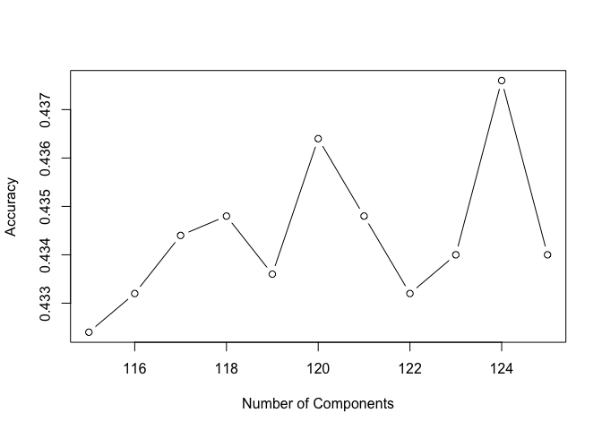

Author Attribution
====================

To set up the analysis, the first step is to read in all associated text
files and create related functions.

    # Read in all texts
    library(tm)

    ## Loading required package: NLP

    library(naivebayes)
    train_author_dirs = Sys.glob('~/Downloads/ReutersC50/C50train/*')
    file_list = NULL
    labels = NULL
    for(author in train_author_dirs) {
      author_name = substring(author, first=29)
      files_to_add = Sys.glob(paste0(author, '/*.txt'))
      file_list = append(file_list, files_to_add)
      labels = append(labels, rep(author_name, length(files_to_add)))
    }

    test_author_dirs = Sys.glob('~/Downloads/ReutersC50/C50test/*')
    for(author in test_author_dirs) {
      author_name = substring(author, first=29)
      files_to_add = Sys.glob(paste0(author, '/*.txt'))
      file_list = append(file_list, files_to_add)
      labels = append(labels, rep(author_name, length(files_to_add)))
    }

    readerPlain = function(fname){
      readPlain(elem=list(content=readLines(fname)), 
                id=fname, language='en')}

    all_docs = lapply(file_list, readerPlain)
    names(all_docs) = file_list

    my_corpus = Corpus(VectorSource(all_docs))

    # Create labels for traing and test set
    clean_labels = NULL
    for (i in 1:5000){
      clean_labels = append(clean_labels, strsplit(labels[i], '/')[[1]][3])
    }
    train_y = clean_labels[1:2500]
    test_y = clean_labels[2501:5000]

    # function for train and test, given the training matrix
    test = function(X){
      train_X = X[1:2500,]
      test_X = X[2501:5000,]
      model <- naive_bayes(x = train_X, y = train_y)
      preds <- predict(model, newdata = test_X)
      conf_matrix <- table(preds, test_y)
      sum = 0
      for (i in 1:50){
        sum = sum +  conf_matrix[i, i]
      }
      return(sum/2500)
    }

Before further processing the data, we did pre-processing such as
removing numbers and punctuations from the original data set.

    # Preprocessing: removing
    my_corpus = tm_map(my_corpus, content_transformer(tolower)) # make everything lowercase
    my_corpus = tm_map(my_corpus, content_transformer(removeNumbers)) # remove numbers
    my_corpus = tm_map(my_corpus, content_transformer(removePunctuation)) # remove punctuation
    my_corpus = tm_map(my_corpus, content_transformer(stripWhitespace)) ## remove excess white-space
    my_corpus = tm_map(my_corpus, content_transformer(removeWords), union(stopwords("SMART"), stopwords('en')))
    DTM = DocumentTermMatrix(my_corpus)

Model 1 - Naive Bayes
---------------------

The first model selected is Naive Bayes. Before we put data into model,
we considered four processing actions to increase accuracy and they
are:  1. Remove terms that count 0 below certain percentage of
docs  2. Remove terms below certain count  3. TF-IDF   4.
PCA  

For action 1, we assigned different percentage to test which generates
the highest accuracy in naive bayes. According to the plot, 0.895 is our
best choice as the percentage, which gives the accuracy of 30.2%.

    acc = NULL
    per_list = seq(0.875, 0.925, 0.01)
    for (i in per_list){
      DTM_test = removeSparseTerms(DTM, i)
      X = as.matrix(DTM_test)
      acc = append(acc, test(X))
    }
    plot(per_list, acc, type='b', ylab='Accuracy', xlab='Percentage Threshold')

    DTM = removeSparseTerms(DTM, 0.895)
    max(acc)

    ## [1] 0.302

The next step is to set the threshold for the minimum count for the bag
of words. Mutiple thresholds have been tested, but no significant
improvement on the accuracy rate. Therefore, the action 2 will not be
taken.

After applying TF-IDF processing, the third tool, to the dataset, its
accuracy increases to 36.2%. Therefore, we decide to adopt TF-IDF.

    X = as.matrix(DTM)
    TF <- X / rowSums(X)
    EXI_NUM<-apply(X>0, 2, function(x){table(x)['TRUE']})
    IDF<-as.numeric(log(nrow(X)/EXI_NUM + 1))
    TFIDF = data.frame(t(t(TF)*IDF))
    X <- TFIDF

The last tool we consider is PCA. PCA requires to select the optimal
number of principal components. Therefore, we draw the following plot to
illustrate the cumulative variance represented for different number of
components. However, we cannot find the "elbow" point on the curve, so
we tested multiple options mannually.

    pca = prcomp(X, scale=TRUE)
    plot(cumsum((pca$sdev)^2)/sum(pca$sdev^2), pch=19, cex=0.1, ylab='Cumulative Variance', xlab='Number of Components' )

According to below curve, when we select the 124 most important
components in PCA, we have further increased our accuracy to 43.76%.

    pca_list = seq(115, 125, 1)
    acc = NULL
    for (i in pca_list){
      X_test = pca$x[, 1:i]
      acc = append(acc, test(X_test))
    }
    plot(pca_list, acc, type='b', ylab='Accuracy', xlab='Number of Components')

    max(acc)

    ## [1] 0.4376

Model 2 - RandomForest
---------------------

The second model selected was RandomForest. In terms of both saving
computational cost and remaining a relatively high accuracy, we choose
the parameter ntree1=100

    library(randomForest)

    ## randomForest 4.6-12

    ## Type rfNews() to see new features/changes/bug fixes.

    testRF<-function(X){
      X_train = X[1:2500,]
      X_test = X[2501:5000,]
      rfmodel <- randomForest(x=X_train,y=factor(train_y),ntree=100)
      predtest = predict(rfmodel,newdata=X_test)
      conf_matrix = table(predtest,test_y)
      sum = 0
      for(i in 1:dim(conf_matrix)[1]){
        sum = sum + conf_matrix[i,i]
      }
      return (sum/2500)
    }

Similary, we iterated through sparcities, and the highest accuracy
occured when we didn't remove anything.

    DTM = DocumentTermMatrix(my_corpus)
    DTM = removeSparseTerms(DTM,0.995)
    X = as.matrix(DTM)
    print(paste('Accuracy for RandomForest is',testRF(X),sep=' '))

 ?? ??## [1] "Accuracy for RandomForest is 0.6324"

After applying TF-IDF processing, its accuracy didn't change much.

    #TFIDF
    X = as.matrix(DTM)
    TF = X/rowSums(X)
    EXI_NUM<-apply(X>0, 2, function(x){table(x)['TRUE']})
    IDF<-as.numeric(log(1 + nrow(X)/EXI_NUM))
    TFIDF = data.frame(t(t(TF)*IDF))
    print(paste('Accuracy for RandomForest after TFIDF is',testRF(X),sep=' '))

 ?? ??## [1] "Accuracy for RandomForest after TFIDF is 0.6336"

We also considered PCA before using RandomForest, however, accuracy reduced to about 52%.

Comparing accuracies of different models, we prefer randomForest with 0.5% sparcity removed.

To figure out whose articles are hard to distinguish, we calculated the classification accuracy of each author using randomForest model. Darren Schuettler, ScottHillis, WilliamKazer, DavidLawder, EdnaFernandes have lowest classification accuracy comparing to others. Therefore, their articles are hard to distinguish.

    library(pander)

    rfmodel <- randomForest(x=X_train,y=factor(train_y),ntree=100)
    predtest = predict(rfmodel,newdata=X_test)
    conf_matrix = table(predtest,test_y)

    author_acc = foreach (i = 1:50, .combine = 'c') %do% {
      conf_matrix[i,i]/sum(conf_matrix[,i])
    }

    names(author_acc) = rownames(conf_matrix)
    pander(sort(author_acc)[1:5])

<table>
<colgroup>
<col width="18%" />
<col width="21%" />
<col width="18%" />
<col width="18%" />
<col width="21%" />
</colgroup>
<thead>
<tr class="header">
<th align="center">DavidLawder</th>
<th align="center">JaneMacartney</th>
<th align="center">ScottHillis</th>
<th align="center">EricAuchard</th>
<th align="center">AlexanderSmith</th>
</tr>
</thead>
<tbody>
<tr class="odd">
<td align="center">0.14</td>
<td align="center">0.2</td>
<td align="center">0.2</td>
<td align="center">0.22</td>
<td align="center">0.24</td>
</tr>
</tbody>
</table>
